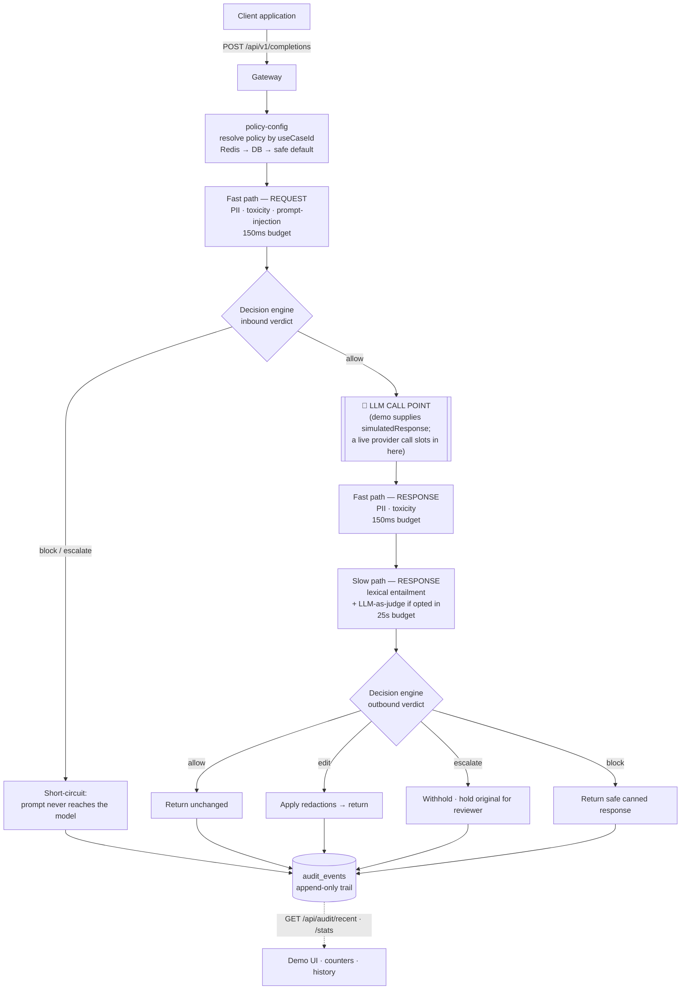

# ControlPlane.AI

**Accenture Innovation Challenge 2026 — Round 2 submission**
Team **Atreides** · Abhay Tripathi (lead), Tanya Singh · IIT Kanpur

---

## 1. Project Overview

ControlPlane.AI is a policy-driven middleware gateway that sits between an enterprise
application and an LLM provider, supervising every call in both directions. Enterprises
deploying LLMs face a supervision gap: the model is a black box, its output varies per
call, and the same answer that is harmless in an internal tool can be a compliance
incident in a customer-facing or regulated one. Existing controls are either baked into
the model (opaque, unauditable) or bolted on as a single on/off content filter (too blunt
to be useful). ControlPlane.AI closes that gap by inspecting every prompt and every
completion against a **per-use-case risk policy**, resolving each call into one of four
graduated outcomes — **allow, edit, escalate, block** — and writing an immutable audit
record of what was decided and why. The governing principle is that the *policy*, not the
model, decides what is acceptable in a given context.

> **Business proposal:** see the Round 1 submission deck,
> `Accenture Innovation Challenge 2026/Round 1/Template.pptx`.
> *(Note: the copy of that deck available at the time of writing is the unfilled template —
> the problem-statement and proposed-solution slides are empty placeholders. The
> architecture attributed to "the proposal" in section 4 below reflects the intended
> production design as carried into this build, not text quoted from that file.)*

---

## 2. Implementation Approach

### Two-lane detection

Inspection is split into two lanes with separate latency budgets, because the cheap
deterministic checks must never wait on the expensive semantic ones.

| Lane | Budget (default) | Detectors | Characteristics |
|---|---|---|---|
| **Fast path** | `150 ms` | PII, toxicity, prompt-injection | In-process, deterministic, no network. Runs on **every** call. A detector that overruns is dropped, not awaited — the budget is enforced by racing the whole lane against one timer. |
| **Slow path** | `25 000 ms` | Lexical entailment, LLM-as-judge | Verification against grounding sources. Gated by policy; the LLM judge is additionally opt-in per request because it costs seconds and real money. |

Both lanes share one fan-out helper ([`detector-runner.ts`](src/modules/detection/detector-runner.ts)).
A detector that throws is recorded as a failure rather than propagated, so one broken
detector cannot suppress the findings of the others.

### Tiered decision model

Detectors only *report*; they never decide. Each returns `DetectionSignal`s carrying a
normalised `0..1` score, a label, and evidence. The decision engine maps those onto one
of four tiers:

| Tier | Meaning |
|---|---|
| 🟢 **allow** | Passes through unchanged. |
| 🟡 **edit** | Passes through with redactions applied in place (e.g. PII masked). |
| 🟠 **escalate** | Withheld from the end user and held for human review. The original text is retained for the reviewer, not destroyed. |
| 🔴 **block** | Refused; a safe canned response is returned instead. |

The engine is deliberately conservative: the **most severe** matching outcome wins,
registered rules may only raise severity, and an incomplete verdict (a slow-path timeout)
fails *upward* to the policy's default action rather than reporting a clean result built
on partial evidence.

### Per-use-case policy config

A policy is resolved per request by `useCaseId`. Rather than two global numbers, each
policy carries **per-detector threshold bands** — `editAt` / `escalateAt` / `blockAt`.
A score at or above a band triggers that tier; an unset band means that outcome can never
fire for that signal.

The three seeded policies (verified live via `GET /api/policies`):

| Detector | Band | `internal-copilot` (low) | `customer-support` (medium) | `decision-support` (critical) |
|---|---|---|---|---|
| **pii** | editAt | 0.80 | 0.50 | 0.30 |
| | escalateAt | — | 0.99 | 0.60 |
| | blockAt | — | — | — |
| **toxicity** | escalateAt | 0.90 | 0.70 | 0.50 |
| | blockAt | — | 0.90 | 0.80 |
| **prompt_injection** | escalateAt | 0.85 | 0.60 | 0.40 |
| | blockAt | — | 0.90 | 0.70 |
| **entailment** | escalateAt | 0.80 | 0.40 | 0.30 |
| | blockAt | — | 0.80 | 0.50 |
| **judge** | escalateAt | 0.80 | 0.40 | 0.30 |
| | blockAt | — | 0.80 | 0.50 |

Policy-level fields:

| Field | `internal-copilot` | `customer-support` | `decision-support` |
|---|---|---|---|
| `riskTier` | low | medium | critical |
| `slowPathEnabled` | **false** | true | true |
| `defaultAction` *(derived)* | allow | allow | **escalate** |

Two things this encodes. **PII never blocks** in any policy — it is redactable, so it tops
out at escalate. And `internal-copilot` sets no `blockAt` at all: in the low-risk internal
tool, nothing is ever refused outright, only flagged.

Policies are **versioned, not mutated** — an update writes a new version and deactivates
the old one, so a decision already in the audit trail stays explainable against the exact
policy that produced it. Definitions live in
[`policy-seeder.service.ts`](src/modules/policy-config/policy-seeder.service.ts);
band-to-tier logic in [`threshold.resolver.ts`](src/modules/decision-engine/threshold.resolver.ts).

---

## 3. Solution Architecture

| Module | Path | Responsibility |
|---|---|---|
| **policy-config** | `src/modules/policy-config` | Versioned per-use-case risk config. Read-through Redis cache in front of the database; falls back to a conservative default (HIGH tier, ESCALATE) so an unconfigured use-case is never wide open. Seeds the three demo policies on boot. |
| **detection** | `src/modules/detection` | Orchestrates both lanes behind one `Detector` interface. Fast: PII, toxicity, prompt-injection. Slow: lexical entailment, LLM-as-judge. Reports signals only. |
| **decision-engine** | `src/modules/decision-engine` | Maps signals + policy bands onto one tier. Builds redaction edits from detector spans. Merges by severity. |
| **audit** | `src/modules/audit` | Writes an immutable envelope per decision through the `AuditPublisher` interface. Also serves the read side (`/api/audit/recent`, `/api/audit/stats`). |
| **gateway** | `src/modules/gateway` | The seam itself — walks the pipeline per request and shapes the caller-visible response. |
| *redis* | `src/modules/redis` | Shared Upstash client (global module). |
| *health* | `src/modules/health` | Liveness / readiness probes. |

Shared contracts (`InspectionContext`, `DetectionSignal`, the enums) live in `src/common`,
so no feature module imports another merely for types.

### Request flow



Plain-text equivalent:

```
client
  │
  ▼
gateway ──► policy-config (resolve by useCaseId)
  │
  ├─► FAST PATH  (request)  PII · toxicity · prompt-injection      [150ms]
  │        └─► decision engine ──► block/escalate? ─► STOP (model never called)
  │                                     │
  │                                   allow
  │                                     ▼
  │                        ◄── LLM CALL POINT ──►
  │                                     │
  ├─► FAST PATH  (response) PII · toxicity                          [150ms]
  ├─► SLOW PATH  (response) entailment · LLM-as-judge (opt-in)      [25s]
  │        └─► decision engine ──► allow | edit | escalate | block
  │
  └─► audit ──► audit_events table ──► /api/audit/recent · /stats ──► demo UI
```

---

## 4. Architecture: As Proposed vs. As Built

The intended production architecture specifies **MySQL, Redis, and Kafka**, provisioned
locally via Docker Compose. During the hackathon build window, Docker was unavailable on
the development machine (Docker Desktop's Linux engine could not start — WSL had no
distribution provisioned), so no container could be run. This prototype therefore runs on
substitutes chosen so that each is a **configuration swap, not a rewrite**.

| Concern | As proposed | As built | Path back |
|---|---|---|---|
| **Relational store** | MySQL 8.4 (container) | **SQLite** via `sql.js` (pure-WASM, no native build) | `DATABASE_DRIVER=mysql` + `MYSQL_*` vars. Same entities, same schema — column types are deliberately portable (`varchar` not native enum, `simple-json` not native json), so there is no second entity definition. |
| **Cache** | Redis (container) | **Hosted Upstash Redis** over TLS | Already a real Redis. Point `REDIS_URL` at any instance; TLS is derived from the `rediss://` scheme. |
| **Audit transport** | Kafka topic | **`audit_events` database table** behind the `AuditPublisher` interface | Provide a `KafkaAuditPublisher` and rebind one token. |

### On the Kafka substitution specifically

This is a deliberate design decision, made once and localised on purpose.

The audit module talks to exactly one interface with exactly one method
([`src/modules/audit/interfaces/audit-publisher.interface.ts`](src/modules/audit/interfaces/audit-publisher.interface.ts)):

```ts
export interface AuditPublisher {
  readonly transport: string;
  publishDecision(event: AuditEvent): Promise<void>;
}
```

`AuditEvent` is the **same envelope that would be published to a Kafka topic**, and the
`audit_events` columns are a flat one-to-one mapping of it — nothing is translated or
lost. Rows are keyed on the producer-supplied `eventId` and written append-only, so a
replayed event is idempotent exactly as a Kafka consumer deduping on message key would be.
Content is stored as a SHA-256 hash, never in the clear.

Swapping to Kafka means writing a `KafkaAuditPublisher` that implements that interface and
changing one line in
[`src/modules/audit/audit.module.ts`](src/modules/audit/audit.module.ts):

```ts
{ provide: AUDIT_PUBLISHER, useExisting: DatabaseAuditPublisher }
//                          └── becomes KafkaAuditPublisher
```

`AuditService`, the gateway, the query endpoints, and every consumer stay untouched.

**What the table does not give you, and Kafka would:** durability independent of the
service's own database, and multi-consumer fan-out so alerting, analytics, and compliance
archival can each read the stream at their own pace. A table gets neither — every reader
polls the same rows and competes with the gateway's own writes. That is the reason
production wants Kafka, and the reason the interface exists.

---

## 5. Dependencies

### Runtime prerequisites

| Requirement | Version / note |
|---|---|
| **Node.js** | 20+ · **tested on v22.12.0** |
| **npm** | 10+ · tested on 11.12.1 |
| **Upstash Redis account** | Free tier is sufficient. Must be a `rediss://` (TLS) URL. |
| **Google AI Studio API key** | For the LLM-as-judge slow path. Free tier is sufficient. Optional — the judge self-skips when unset. |
| **C++ build toolchain** | **Not required.** The SQLite driver is `sql.js` (WebAssembly), chosen precisely because `better-sqlite3` needs `node-gyp` and a compiler. |

### Runtime dependencies (`package.json`)

| Package | Purpose |
|---|---|
| `@nestjs/common` · `core` · `platform-express` `^11` | Framework |
| `@nestjs/config` `^4` | Typed configuration + env validation |
| `@nestjs/typeorm` `^11` · `typeorm` `^0.3.20` | ORM / data access |
| `sql.js` `^1.12` | SQLite (WASM) — local dev datasource |
| `mysql2` `^3.11` | MySQL driver — production datasource |
| `ioredis` `^5.4` | Redis client (Upstash, TLS) |
| `@google/generative-ai` `^0.24` | Gemini SDK — AI-as-judge provider |
| `@nestjs/swagger` `^11` | OpenAPI docs at `/docs` |
| `@nestjs/terminus` `^11` | Health probes |
| `class-validator` `^0.14` · `class-transformer` `^0.5` | DTO validation |
| `@nestjs/microservices` `^11` | Retained for the future Kafka transport |
| `reflect-metadata` · `rxjs` | Framework peer requirements |

### Dev dependencies

`@nestjs/cli` · `@nestjs/schematics` · `@nestjs/testing` `^11` · `typescript` `^5.6` ·
`jest` `^29.7` + `ts-jest` · `supertest` `^7` · `eslint` `^9.14` (flat config) +
`typescript-eslint` `^8.14` · `prettier` `^3.3` + `eslint-plugin-prettier` ·
`ts-node` · `ts-loader` · `tsconfig-paths` · `source-map-support` ·
types for `node`, `jest`, `express`, `supertest`, `sql.js`.

---

## 6. Execution Instructions — Two Paths

### Path A — Without Docker ✅ *tested, working*

This is the path that was actually run and verified end to end.

**Prerequisites**

1. **Node.js 20+** (tested on v22.12.0) and npm.
2. An **Upstash Redis** free-tier database — copy its `rediss://...` connection string.
3. A **Google AI Studio** API key (optional; only for the LLM-as-judge checkbox).

**Steps**

```bash
git clone <repository-url>
cd ControlPlane.AI
npm install
```

```bash
cp .env.example .env
```

Fill in the two required values in `.env`:

```
REDIS_URL=rediss://default:<token>@<endpoint>.upstash.io:6379
GEMINI_API_KEY=<your-google-ai-studio-key>
```

Everything else has a working default. Then:

```bash
npm run build
npm run start:dev
```

**There is no separate seed command.** The three policies are seeded automatically on
application bootstrap by
[`PolicySeederService`](src/modules/policy-config/policy-seeder.service.ts), which is
idempotent by `useCaseId` — an existing policy is left alone, so edits survive a restart.
On first boot the log reads:

```
[PolicySeederService] Seeded 3 policy/policies: internal-copilot, customer-support, decision-support
```

**Then open:**

| URL | What it is |
|---|---|
| <http://localhost:3000/demo/> | Interactive demo UI *(note the trailing slash; `/demo` 301-redirects to it)* |
| <http://localhost:3000/docs> | Swagger / OpenAPI reference |
| <http://localhost:3000/health> | Liveness probe |
| <http://localhost:3000/health/ready> | Readiness — reports Redis state and active audit transport |

The service starts even if Redis is unreachable: it logs a warning, gives up after five
bounded retries, and runs without cache. It does **not** start without a working database.

**Resetting between demo takes**

```bash
npm run demo:reset
```

Deletes the `./data` directory — the SQLite file holding both the audit trail and the
seeded policies. Restart the app and the three policies are reseeded from scratch with an
empty audit log and zeroed counters. Useful before recording, since the demo counters read
all-time persisted totals rather than per-session ones.

**Tests**

```bash
npm test          # unit tests
npm run test:e2e  # end-to-end (boots the real app against a throwaway SQLite file)
```

**Other available scripts**

```bash
npm run start          # run once, no watch
npm run start:prod     # node dist/main
npm run lint           # eslint --fix
npm run lint:check     # eslint, no writes
npm run format         # prettier over src/ and test/
npm run test:cov       # coverage
npm run test:watch     # watch mode
```

---

### Path B — With Docker ⚠️ *production-parity; **not executed in this environment***

> **Status.** This path uses [`docker-compose.prod-parity.yml`](docker-compose.prod-parity.yml)
> and mirrors the production architecture described in the business proposal. It was **not
> run end-to-end in this environment** due to a local development-machine issue unrelated
> to the code (Docker Desktop's Linux engine would not start; WSL had no distribution
> provisioned). **The Docker Compose file itself has never been executed** — its syntax
> validates via `docker compose config`, but nothing beyond that has been verified. Treat
> it as unproven and check it before relying on it.

**Prerequisites:** Docker and Docker Compose installed and running.

**Steps**

```bash
docker compose -f docker-compose.prod-parity.yml up -d
# or: npm run docker:up
```

This brings up MySQL 8.4, Redis 7.4, Kafka 3.7 (KRaft mode, no ZooKeeper), and Kafka UI
on <http://localhost:8080>.

Then set these in `.env` to point at the containers instead of the hosted services:

```
DATABASE_DRIVER=mysql
MYSQL_HOST=localhost
MYSQL_PORT=3306
MYSQL_USER=controlplane
MYSQL_PASSWORD=controlplane
MYSQL_DATABASE=controlplane

REDIS_URL=redis://localhost:6379
```

```bash
npm install
npm run build
npm run start:dev
```

Tear down with `npm run docker:down`.

**Two honest caveats about this path:**

1. **There are no `KAFKA_*` environment variables, because there is no Kafka client in the
   code.** The `kafkajs` dependency was removed when the audit transport was swapped for
   the database publisher. The compose file starts a broker, but nothing in the
   application connects to it until a `KafkaAuditPublisher` is written (see section 4).
   Bringing up the Kafka container is currently useful only for validating the broker
   itself.
2. **`DATABASE_SYNCHRONIZE` defaults to `false` on MySQL**, because migrations are meant to
   own the production schema — and **no migrations have been written yet**. To try this
   path today you must either set `DATABASE_SYNCHRONIZE=true` (acceptable for a throwaway
   local container, never for production) or author the migrations first. This is listed
   in Known Limitations.

---

## 7. Demo Script

Six scenarios, all verified against the running gateway and locked into
[`test/gateway.e2e-spec.ts`](test/gateway.e2e-spec.ts) so they cannot silently drift. Each
is a one-click button in the demo UI.

| # | Scenario | Use case | Tier | What fires |
|---|---|---|---|---|
| 1 | Clean, grounded answer | customer-support | 🟢 **ALLOW** | nothing crosses a threshold |
| 2 | Email + phone in the response | customer-support | 🟡 **EDIT** | `pii/EMAIL 0.97`, `pii/PHONE 0.95` → redacted in place |
| 3 | Unsupported gift-card claim | customer-support | 🟠 **ESCALATE** | `entailment/unverifiable 0.50` |
| 4 | "90 days" against a 30-day source | customer-support | 🔴 **BLOCK** | `entailment/contradicted 0.95` |
| 5 | Abusive language | customer-support | 🟠 **ESCALATE** | `toxicity/HARASSMENT 0.85` |
| 6 | "Ignore all previous instructions…" | customer-support | 🔴 **BLOCK** | `prompt_injection/INSTRUCTION_OVERRIDE 0.92` — decided at the **request** stage; the prompt never reaches the model |

Exact inputs for scenarios 1–4:

| # | Prompt | Simulated response | Grounding source |
|---|---|---|---|
| 1 | What is your refund window? | Refunds are accepted within 30 days of purchase. | Refunds are accepted within 30 days of the purchase date. |
| 2 | How do I reach my account manager? | You can reach Dana Patel directly at dana.patel@example.com or on 415-555-0142 for anything urgent. | — |
| 3 | Can I get a refund on a gift card? | Gift cards are fully refundable at any branch, and managers can authorise goodwill credit on request. | Refunds are accepted within 30 days of the purchase date. |
| 4 | How long do I have to return an item? | You have a full 90 days to return any item for a complete refund. | Returns are accepted within 30 days of the purchase date. |

### ⭐ The highlighted walkthrough: one input, three verdicts

Load scenario 3 and change **only the use-case dropdown**. The content is byte-identical;
the outcome is not:

| Use case | Risk tier | Outcome | Why |
|---|---|---|---|
| `internal-copilot` | low | 🟢 **ALLOW** | `slowPathEnabled: false` — verification never runs for the trusted internal audience |
| `customer-support` | medium | 🟠 **ESCALATE** | signal `0.50` clears the `escalateAt: 0.40` band |
| `decision-support` | critical | 🔴 **BLOCK** | signal `0.50` clears the `blockAt: 0.50` band — unsupported claims are unacceptable in a regulated context |

This is the thesis of the project in a single interaction: **the same model output is
acceptable in one context and unacceptable in another, and the policy — not the model —
decides which.** It is covered by the e2e test
`applies a different tier to identical content per use-case policy`.

### Live LLM judge

The **Use LLM-as-judge (Gemini)** checkbox routes verification through a live Gemini call
instead of the deterministic lexical check. It is **off by default**: measured latency is
2.5–20 s, which is a long silence on a recording. Enable it for one take to show a real
model in the loop.

---

## 8. Testing

```bash
npm test          # unit
npm run test:e2e  # end-to-end
npm run test:cov  # coverage
```

**Current status — all passing:**

| Suite | Files | Tests |
|---|---|---|
| Unit (`npm test`) | 8 | **50** |
| End-to-end (`npm run test:e2e`) | 3 | **12** |

Unit coverage sits on the logic where a bug would be silent: threshold banding, tier
merging, redaction offsets, PII detection (including Luhn validation and overlapping-match
suppression), judge verdict parsing, and the confidence→severity mapping.

The e2e suite boots the **real `AppModule`** against a throwaway SQLite file — proving the
app runs with no Docker, no Kafka, and no reachable Redis — and walks all six demo
scenarios plus the cross-policy comparison and audit persistence.

```bash
npm run lint:check   # ESLint, zero warnings
npm run build        # tsc via nest build, zero errors
```

---

## 9. Project Structure

```
src/
├── app.module.ts                    # composition root; SQLite/MySQL datasource switch
├── main.ts                          # bootstrap, global prefix, Swagger, /demo static
├── common/                          # shared contracts — imported by every module
│   ├── enums/                       #   RiskTier · DecisionAction · DetectionType
│   ├── interfaces/                  #   InspectionContext · DetectionSignal
│   ├── filters/                     #   AllExceptionsFilter
│   └── interceptors/                #   TraceInterceptor (x-trace-id in/out)
├── config/                          # typed configuration + env validation
└── modules/
    ├── policy-config/               # ── versioned per-use-case risk config
    │   ├── entities/                #    policy_configs table
    │   ├── policy-config.service.ts #    read-through Redis cache → DB → safe default
    │   └── policy-seeder.service.ts #    the 3 seeded policies
    ├── detection/                   # ── two-lane detector orchestration
    │   ├── detector-runner.ts       #    shared fan-out + timeout race
    │   ├── fast-path/               #    pii · toxicity · prompt-injection
    │   └── slow-path/               #    entailment · judge
    │       └── judge/               #      JudgeProvider iface + Gemini impl
    ├── decision-engine/             # ── signals + bands → one tier
    │   └── threshold.resolver.ts    #    band→action, severity ordering
    ├── audit/                       # ── immutable decision trail
    │   ├── interfaces/              #    AuditPublisher (the Kafka seam)
    │   ├── publishers/              #    DatabaseAuditPublisher
    │   └── audit-query.service.ts   #    read side for the demo UI
    ├── gateway/                     # ── the seam; walks the whole pipeline
    ├── redis/                       # shared Upstash client
    └── health/                      # liveness / readiness

public/index.html                    # demo UI (single file, no build step)
test/                                # e2e specs: gateway · audit · health
docker-compose.prod-parity.yml       # optional production-parity stack (see Path B)
```

---

## 10. Known Limitations / Honest Notes

These are real constraints of the prototype, stated plainly.

1. **The entailment check is a lexical heuristic, not a semantic model.** It detects
   numeric conflicts (a figure in the response absent from the grounding sources) and
   measures content-term overlap against a 40% support threshold. It is deterministic and
   fast, which is what a scripted demo needs, but it will miss paraphrased contradictions
   and can flag correct answers phrased in unfamiliar vocabulary. It is intentionally
   biased toward `unverifiable` over `verified`, so an unsupported claim is never waved
   through. The LLM judge behind the same interface is the real implementation.

2. **The AI-as-judge layer uses Gemini, but is model-agnostic by design.** Nothing in
   detection, decisioning, or audit knows which vendor answers — all of it speaks to
   [`JudgeProvider`](src/modules/detection/slow-path/judge/judge-provider.interface.ts),
   which names no vendor, SDK type, or model. `DetectionModule` is the only file that binds
   a provider. Substituting OpenAI, Anthropic, or a self-hosted model is a new class plus
   one token binding. *Note:* the default model is `gemini-3.6-flash`, not `gemini-2.5-flash`
   — the latter is closed to new API keys and its endpoint returns 404. Override with
   `GEMINI_MODEL`.

3. **Kafka is represented by a database-backed audit table behind a swappable interface,
   not a live broker.** Covered in full in section 4. The consequence to be aware of: the
   trail has no durability independent of the application database and supports no
   multi-consumer fan-out.

4. **No database migrations exist yet.** SQLite dev relies on TypeORM `synchronize: true`.
   MySQL correctly defaults it to `false`, which means the MySQL path needs migrations
   authored before it can create its schema. This is the first thing to build for a
   production run.

5. **The demo counters are all-time, not per-session.** That is the honest consequence of
   sourcing them from persisted `audit_events` rather than browser state, which was the
   point. Use `npm run demo:reset` for a clean slate.

6. **Toxicity detection is a term lexicon**, not a classifier — adequate for demonstrating
   the tiering, insufficient for production. It sits behind the same `Detector` interface,
   so a local classifier drops in without touching anything else.

7. **The gateway does not yet call a real LLM.** `POST /api/v1/completions` accepts a
   `simulatedResponse` field so each decision tier can be exercised deterministically. The
   provider call is a marked, single-line insertion point in
   [`gateway.service.ts`](src/modules/gateway/gateway.service.ts); everything downstream of
   it is complete and unchanged by the swap.

8. **Escalation is terminal, not a workflow.** An escalated call is withheld and its
   original text retained under an `escalationId`, but there is no reviewer queue or
   approval UI. Human-in-the-loop review is designed for, not built.
